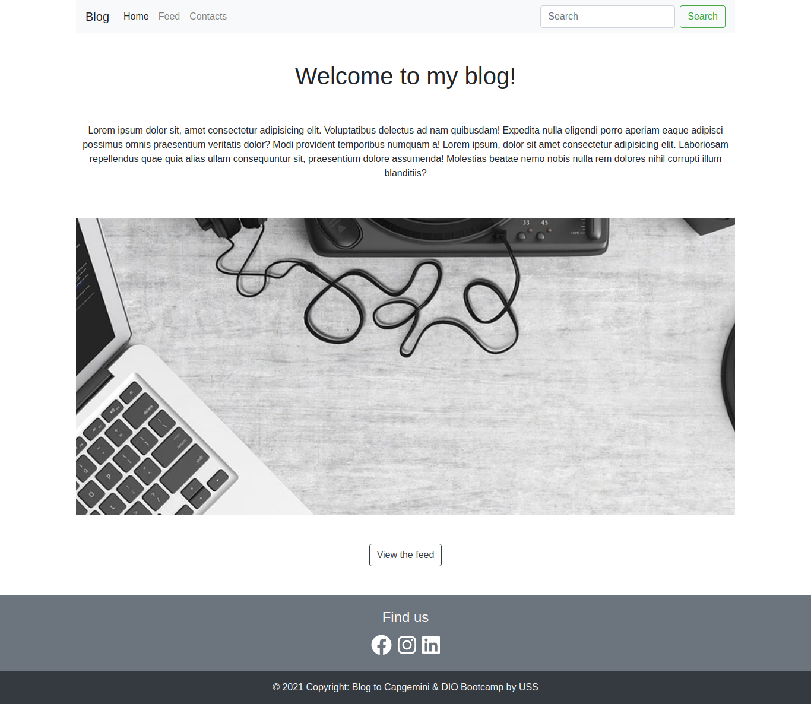
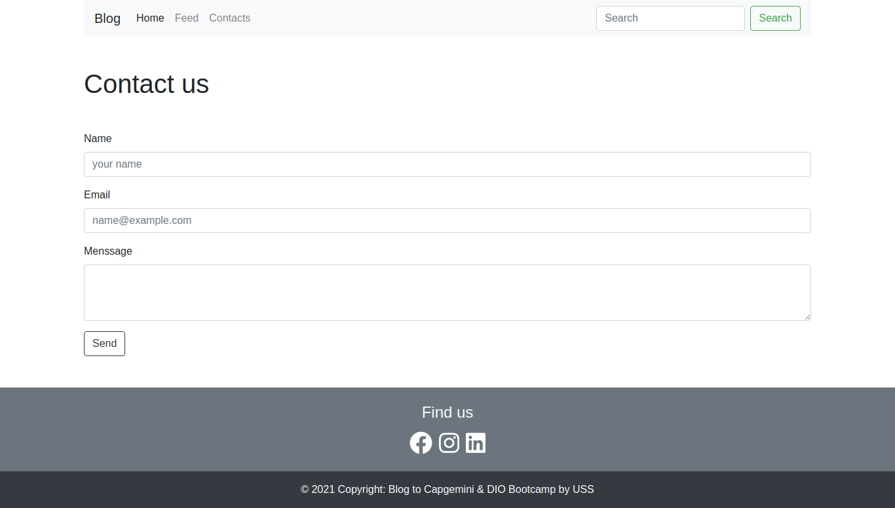
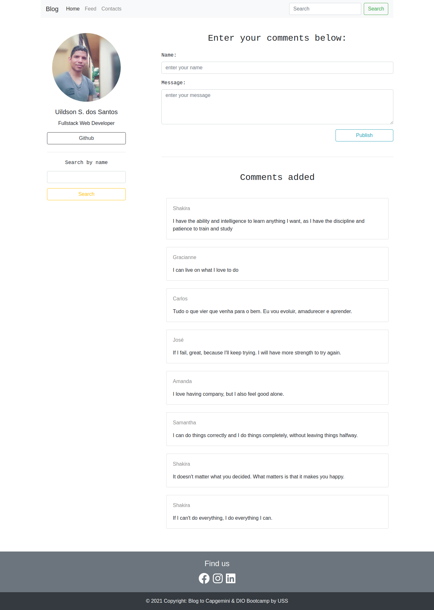

# blog-uss DIO-Capgemini

## What You Need

This project was generated with

[Angular CLI](https://github.com/angular/angular-cli) version 12.2.4.

[NPM](https://docs.npmjs.com/cli/v7) version 7.22.0

## Getting started

Clone this repository:

```bash
git clone https://github.com/UildsonSantos/blog-uss_DIO-Capgemini.git
```

After enter the directory

```bash
cd blog-uss_DIO-Capgemini.git/backend
```

Install package json

```bash
npm install
```

start the server

```bash
npm start
```

## Development server

in another terminal

```bash
cd blog-uss_DIO-Capgemini.git/frontend/blog-capgemini-dio
```

Install package json

```bash
npm install
```

Run `ng serve -o` for a dev server. The application will navigate to `http://localhost:4200/`. The app will automatically reload if you change any of the source files.

## Build

Run `ng build` to build the project. The build artifacts will be stored in the `dist/` directory. Use the `--prod` flag for a production build.

## Main features

### Home



### Contacts



### Feed


